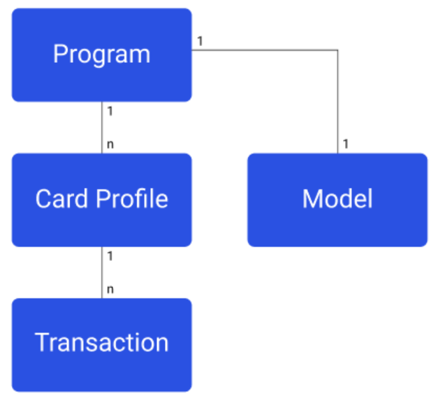

# Group 7 Project Repository

## Team Contributors

- [Lucas](contributors/lucas.md)
- [Tanaya](contributors/tanaya.md)
- [Andy](contributors/andy.md)
- [Fahad](contributors/fahad.md)
- [Timi](contributors/timi.md)
- [Benji](contributors/benji.md)
- [Anqi](contributors/anqi.md)
- [Yanqian](contributors/yanqian.md)

## 1. Project Initialization

### Backend 

The backend is developed using the [Egg.js](https://www.eggjs.org) framework and we use `npm install` to install dependencies listed in `package.json` file, or to install a specific package into the project's `node_modules` directory. 

```shell
cd backend
npm install
```

In backend, we use the library `axios` to interact with [Hackathon API](https://hackathon.capitalone.co.uk). So we need to install `axios` beforehand.

The `egg-mock` framework and `mocha` library is adopted as the test tools for backend. It could be installed by the following command

### Frontend

The frontend is built with the [React](https://github.com/facebook/create-react-app) library. Likewise, we use `npm install` to add all dependencies.

```shell
cd frontend
npm install
```

## 2. Launch the Project

### Backend

In [backend](./backend/) directory, the project could be started by running the following command:

```shell
npm run dev
```

After starting the server, access it via http://localhost:7001/.

The currently implemented APIs are detailed in the [router configuration file](./backend/app/router.js). And the full API document could be found [here](./API-Schema.md)

Information on how to connect the database using prism can be found [here](./backend/prisma/README.md)

### Frontend

In [frontend](./frontend/) directory, the project could be started by running the following command:

```shell
npm start
```

The website would be available at http://localhost:3000

## 3. Testing

### Backend

To run all tests for backend, use the following command
```shell
npm test
```

### Frontend

The frontend has been thoroughly tested, and all tests have successfully passed. To run the tests, use the following command:

```shell
npm test /src/tests
```

### Cypress

Cypress could be launched using either following command:

```shell
npm run cypress:open
npx cypress open
```

More detailed documentation could be found [here](https://docs.cypress.io/guides/overview/why-cypress/)


## 4. Create Fake Data

### Account and Transaction

Create a random account with two transactions:
```shell
curl -X POST http://localhost:7001/accounts
```

Create five random transactions for a sepcified account:
```shell
curl -X POST http://localhost:7001/accounts/:accountID/transactions
```

### Creating/Viewing Accounts & Transactions with Python

Alternatively, you can use the provided Python files to create and view accounts and transactions

#### Creating Accounts & Transactions

##### Accounts

1) To create accounts go into the `/accounts` folder using the command `cd accounts`.

2) From there enter `python account-create-random.py`. You will then be asked how many account you would like created and how many transactions you want each account to have.

3) Once you have entered the required details the accounts will be created and will be printed in in JSON format to the console

##### Transactions

1) To create transactions go into the `/transactions` folder using the command `cd transactions`.

2) From there enter `python tran-create-random.py`. You will then be asked for the account ID of the account you would like to add transactions to and how many transactions you want added to the account. **Note that transactions cannot be added to accounts with a 'suspended' or 'closed' status.**

3) Once you have entered the required details the transactions will be created and will be printed in in JSON format to the console 

#### Getting Accounts & Transactions Created From API

##### Accounts

1) To get account info go into the `/accounts` folder using the command `cd accounts`.

###### Viewing All Accounts

2) Enter `python account-get-all.py`.

3) All accounts and their information will then be printed to the terminal.

###### Viewing Account By ID

2) Enter `python account-get-by-id.py`. You will then be prompted to enter an account ID.

3) All information for that specific account will then be printed out to the console.

##### Transactions

1) To view transaction information go into the `/transactions` folder using the command `cd transactions`.

###### Viewing All Transactions from One Account

2) Enter `python tran-get-all.py`. You will then be prompted to enter an account ID.

3) All transactions related to the account (if found) entered will then be printed to the console.

###### Vieiwng A Specific Transaction On A Specific Account

2) Enter `python tran-get-all.py`. You will then be prompted to enter an account ID and transaction ID.

3) Once all required information is entered, the details of the specific transaction (if found) in the account specified will be printed to the terminal

#### Create fake data without using Hack-API

There are two python files for create temporary fake data of accounts and transactions.

Run these files separately, it would generate an `Account.json` file and `Transaction.json` file in the current working directory, which conform to the format of Hackathon API.

```shell
python create_account.py
python create_transaction.py
```

The default number of created accounts and transactions are `5`, and the default `accountID` of the created transactions are `12345678`. Feel free to modify it manually in function `main()`.

```python
def main():
    numOfAccounts = 5

def main():
    numOfTransactions = 5
    account_id = '12345678'
```

## 5. Carbon API

For this project, we will be using an API provided by [Carbon Interface](https://docs.carboninterface.com/#/) to provide us with carbon impact estimates for our transactions. They have a dedicated feature in the API named `Carbon Ledger` which allows us to input data about a transaction (amount spent, merchant data, etc.) and in return we get a carbon score in grams.

The image below shows the data model for the Carbon Ledger. All of our data will be stored in a Program, which contains Card Profiles, which is the equivalent of an account in the Hackathon API. Each Card Profile contains transactions, where a carbon impact estimate is also stored. The model is the underlying algorithm that calculates the carbon emissions for transactions. At the moment, we are only able to use one test model provided by Carbon Interface themselves. Furthermore, the Carbon Ledger is in Beta, so it likely doesn't produce the most accurate carbon impact estimate.


By default, accounts and transactions are created in the Carbon API when running the commands listed in [Account and Transaction](#Account-and-Transaction), providing us with a carbon impact score for every transaction, but you could also do the same (and more) with the provided Python files:

 - [Creating Card Profile (Account)](Carbon-API/create_card_profile.py)
 - [Deleting Card Profile](Carbon-API/delete_card_profile.py)
 - [Retrieve all Card Profiles](Carbon-API/get_all_card_profiles.py)
 - [Retrieve Card Profile by ID](Carbon-API/get_card_profile_by_id.py)
 - [Create Transaction](Carbon-API/add_transaction.py)
 - [Retrieve all Transactions on a specific account](Carbon-API/get_all_transactions.py)
 - [Retrieve a Transaction by ID](Carbon-API/get_transaction_by_id.py)
 - [Retrieve Carbon Impact Score of specific Transaction](Carbon-API/get_carbon_impact_from_transaction.py)

 > **Note:** Transactions cannot be deleted once they have been created

 To run these files enter `python {path_of_file}` and follow the prompts.